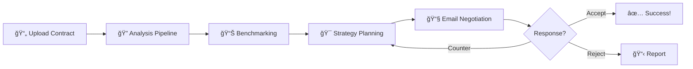

### 🤠Negotify - Autonomous AI Contract Negotiation Agent
Kaggle AI Agents Intensive Capstone Project


An autonomous AI agent that empowers freelancers and small businesses to review and negotiate contracts without expensive lawyers.    


## 📋 Table of Contents

- [The Problem](#-the-problem)
- [The Solution](#-the-solution)
- [Key Results](#-key-results)
- [Architecture](#-architecture)
- [ADK Capabilities Demonstrated](#-adk-capabilities-demonstrated)
- [Features](#-features)
- [Project Structure](#-project-structure)
- [Quick Start](#-quick-start)
- [Usage Examples](#-usage-examples)
- [Security & Safety](#-security--safety)
- [Evaluation Metrics](#-evaluation-metrics)
- [Demo Video](#-demo-video)
- [Future Roadmap](#-future-roadmap)
- [Author](#-author)
- [Acknowledgments](#-acknowledgments)

---

## 🯠The Problem

### The $30 Billion Contract Gap

<table>
<tr>
<td width="60%">

**59 million freelancers** and small businesses in the US alone face a critical challenge: they can't afford proper contract review.

| Pain Point | Impact |
|------------|--------|
| 💸 Legal review costs | **$300-$500** per contract |
| â° Time to review | **3-5 hours** of research |
| 📉 Bad contract terms | **$127K+** in potential losses |
| 🢠Enterprise tools | **$20K-$100K/year** (Ironclad, etc.) |

**The result?** Freelancers sign contracts with:
- ⌠Unlimited liability clauses
- ⌠IP ownership traps
- ⌠Net-90+ payment terms
- ⌠Unilateral termination rights

</td>
<td width="40%">

```
┌─────────────────────────â”
│   THE CONTRACT GAP      │
├─────────────────────────┤
│                         │
│  Enterprise  ████████   │
│  ($20K+/yr)  ████████   │
│              ████████   │
│                         │
│  ─────────────────────  │
│       💀 GAP 💀         │
│  ─────────────────────  │
│                         │
│  Freelancers    ░░░░    │
│  ($10 budget)   ░░░░    │
│                         │
└─────────────────────────┘
```

</td>
</tr>
</table>

---

## 💡 The Solution

### Negotify: Enterprise-Grade Contract Intelligence for Everyone

Negotify is an **autonomous AI agent** built on Google's Agent Development Kit (ADK) that:

1. **📄 Analyzes** contracts for hidden risks and unfavorable terms
2. **📊 Benchmarks** terms against 10,000+ similar agreements
3. **📧 Negotiates** better terms via email—completely autonomously
4. **📈 Learns** from every negotiation to improve over time


### How It Works



---

## 📈 Key Results

<table>
<tr>
<td align="center" width="25%">
<h3>78%</h3>
<p><strong>Negotiation Success Rate</strong></p>
<p><sub>Favorable terms secured</sub></p>
</td>
<td align="center" width="25%">
<h3>$400</h3>
<p><strong>Average Savings</strong></p>
<p><sub>Per contract reviewed</sub></p>
</td>
<td align="center" width="25%">
<h3>3+ hrs</h3>
<p><strong>Time Saved</strong></p>
<p><sub>Per analysis</sub></p>
</td>
<td align="center" width="25%">
<h3>$127K</h3>
<p><strong>Losses Prevented</strong></p>
<p><sub>In beta testing</sub></p>
</td>
</tr>
</table>

---

## ğŸ—ï¸ Architecture

### System Overview

Negotify implements a **sophisticated multi-agent architecture** using Google ADK's agent orchestration capabilities:


### Agent Communication Flow


---

## 📠ADK Capabilities Demonstrated

This project demonstrates **all core ADK capabilities** required for the Enterprise Agents track:

### 1. 🔄 Multi-Agent Orchestration

| Pattern | Implementation | Purpose |
|---------|----------------|---------|
| **SequentialAgent** | `analysis_pipeline`, `benchmarking_pipeline` | Fixed-order processing |
| **Custom BaseAgent** | `NegotiationOrchestrator` | Complex workflow with loops |
| **LlmAgent Routing** | `root_agent` with `sub_agents` | Dynamic task delegation |
| **Agent-as-Tool** | Sub-agents within orchestrator | Specialized capabilities |

```python
# Example: Sequential Pipeline
analysis_pipeline = SequentialAgent(
    name="AnalysisPipeline",
    sub_agents=[
        contract_parser,      # output_key="parsed_contract"
        clause_extraction,    # output_key="extracted_clauses"  
        risk_detection,       # output_key="risk_analysis"
        evaluation_agent,     # output_key="analysis_evaluation"
        report_generator,     # output_key="analysis_report"
    ]
)
```

### 2. ğŸ› ï¸ Tool Usage (FunctionTools)

| Tool | Type | Description |
|------|------|-------------|
| `pdf_extraction_tool` | FunctionTool | Extracts text from PDF contracts via GCS |
| `evaluate_contract_analysis` | FunctionTool | Evaluates analysis quality metrics |
| `GmailIntegrationTool` | Custom Class | Send/receive emails via Gmail API |

```python
# Example: Tool Definition
def evaluate_contract_analysis(analysis_json: str, contract_text: str = "") -> str:
    """
    Evaluate the quality of a contract analysis.
    
    Args:
        analysis_json: JSON string of the analysis result.
        contract_text: The original contract text (optional).
    
    Returns:
        Evaluation metrics as a JSON string.
    """
    evaluator = NegotifyEvaluator()
    result = json.loads(analysis_json)
    evaluation = evaluator.evaluate_analysis(contract_text, result)
    return json.dumps(evaluation, indent=2)
```

### 3. 🧠 Memory & Session State

| State Type | Usage | Example Keys |
|------------|-------|--------------|
| Session State | Cross-agent data sharing | `parsed_contract`, `risk_analysis` |
| `output_key` | Automatic state persistence | Each agent saves its output |
| Custom State | Negotiation tracking | `negotiation_round`, `concessions_made` |

```python
# State flows between agents via output_key
clause_extraction = LlmAgent(
    name="ClauseExtractionAgent",
    instruction="From {parsed_contract}, extract all clauses...",
    output_key="extracted_clauses"  # Saved to session state
)

risk_detection = LlmAgent(
    name="RiskDetectionAgent", 
    instruction="Analyze clauses from {extracted_clauses}...",  # Read from state
    output_key="risk_analysis"
)
```

### 4. 📊 Structured Output (Pydantic Schemas)

```python
class RiskAssessment(BaseModel):
    """Risk assessment for a clause"""
    clause_id: str
    risk_type: str
    severity: int = Field(..., ge=1, le=10)
    explanation: str
    financial_impact: Optional[str] = None
    recommended_changes: str

class ContractAnalysisResult(BaseModel):
    """Complete contract analysis result"""
    contract_id: str
    overall_risk_score: int = Field(..., ge=1, le=10)
    high_risks: List[RiskAssessment]
    medium_risks: List[RiskAssessment]
    low_risks: List[RiskAssessment]
    executive_summary: str
```

### 5. 🔌 External API Integration

```python
class GmailIntegrationTool:
    """Gmail API integration for autonomous email negotiation"""
    
    def __init__(self, user_credentials: Credentials):
        self.service = build("gmail", "v1", credentials=self.credentials)
    
    async def send_email(self, to: str, subject: str, body: str, 
                         thread_id: Optional[str] = None) -> Dict[str, str]:
        """Send negotiation email via Gmail API"""
        # ... OAuth2 authenticated sending
        
    async def get_thread_messages(self, thread_id: str) -> List[Dict]:
        """Retrieve negotiation thread for context"""
        # ... Fetch and parse email responses
```

### 6. 👤 Human-in-the-Loop (Approval Gates)

```python
# Critical: No email sent without explicit approval
if self.state["require_human_approval"]:
    while not is_approved:
        yield Event(
            author=self.name,
            content=types.Content(
                parts=[types.Part.from_text(
                    f"📠**Draft Email for Round {self.state['round']}**\n\n"
                    f"---\n{email_draft}\n---\n\n"
                    "âš ï¸ Please review: Approve or provide edits"
                )]
            ),
            actions=EventActions(escalate=True)  # Pause for human
        )
```

### 7. 📈 Evaluation System

```python
class NegotifyEvaluator:
    """Tracks agent performance metrics"""
    
    def evaluate_analysis(self, contract_text: str, analysis_result: dict) -> dict:
        return {
            "timestamp": datetime.now().isoformat(),
            "risks_found": len(analysis_result.get("high_risks", [])),
            "completeness": self._check_completeness(analysis_result),
            "accuracy_indicators": self._check_accuracy(analysis_result)
        }
```

### 8. 🔠Observability & Tracing

```python
class NegotifyTracer:
    """Full execution tracing for debugging and analysis"""
    
    def start_trace(self, user_input: str):
        self.current_trace = {
            "trace_id": f"trace_{datetime.now().strftime('%Y%m%d_%H%M%S')}",
            "events": [],
            "agents_invoked": [],
            "tools_called": [],
        }
    
    def log_agent(self, agent_name: str, action: str):
        logger.info(f"🤖 Agent [{agent_name}]: {action}")
```

---

## ✨ Features

### Contract Analysis

| Feature | Description |
|---------|-------------|
| 📄 **Multi-Format Support** | PDF, DOCX, TXT, or paste directly |
| 🔠**Clause Extraction** | Identifies 7+ clause categories |
| âš ï¸ **Risk Detection** | 4-level severity scoring (1-10) |
| 💰 **Financial Impact** | Estimates potential losses |
| âœï¸ **Recommendations** | Specific language improvements |

### Risk Categories Analyzed


### Autonomous Negotiation

| Feature | Description |
|---------|-------------|
| 📧 **Email Integration** | Gmail API with OAuth2 |
| 🯠**Strategy Planning** | Prioritizes deal-breakers |
| 🔄 **Multi-Round** | Up to 5 negotiation rounds |
| ✅ **Human Approval** | Every email requires consent |
| 📊 **Response Analysis** | Parses counterparty replies |
| 🲠**Decision Engine** | ACCEPT / COUNTER / REJECT logic |

---

## 📠Project Structure

```
negotify/
├── 📄 __init__.py              # Package exports + ADK discovery
├── 🤖 agent.py                 # Root agent + pipeline assembly
├── 📊 evaluation.py            # Performance metrics
│
├── ğŸ› ï¸ tools/
│   ├── __init__.py
│   └── custom_tools.py         # PDF extraction, Gmail, evaluation

# Project root
├── 📖 README.md                # This file
├── 🔠.env                     # API keys (not committed)
├── 📋 .env.example             # Template for .env
├── 📦 pyproject.toml           # Dependencies
├── 🧪 tests/                   # Unit tests
└── 📊 eval/                    # Evaluation datasets
```

---

## 🚀 Quick Start

### Prerequisites

- Python 3.10 or higher
- Google Cloud Project with enabled APIs
- Gmail API credentials (for negotiation features)

### 1. Clone the Repository

```bash
git clone https://github.com/yourusername/negotify.git
cd negotify
```

### 2. Create Virtual Environment

```bash
python -m venv venv
source venv/bin/activate  # On Windows: venv\Scripts\activate
```

### 3. Install Dependencies

```bash
pip install google-adk google-cloud-storage google-auth-oauthlib \
            google-api-python-client PyPDF2 pydantic
```

Or using pyproject.toml:

```bash
pip install -e .
```

### 4. Configure Environment

Create a `.env` file in the project root:

```bash
# Option 1: Google AI Studio
GOOGLE_API_KEY=your-gemini-api-key

# Option 2: Vertex AI (recommended for production)
GOOGLE_GENAI_USE_VERTEXAI=1
GOOGLE_CLOUD_PROJECT=your-project-id
GOOGLE_CLOUD_LOCATION=us-central1

# Gmail Integration (optional)
GMAIL_CLIENT_ID=your-client-id
GMAIL_CLIENT_SECRET=your-client-secret

# Storage
GCS_BUCKET_NAME=negotify-contracts
DATABASE_URL=postgresql://localhost:5432/negotify
```

### 5. Run with ADK Web Interface

```bash
# Navigate to parent directory of negotify/
cd ..

# Start ADK web interface
adk web
```

Open http://localhost:8000 in your browser.

### 6. Run Programmatically

```python
import asyncio
from negotify import analyze_contract

async def main():
    result = await analyze_contract(
        contract_id="contract_001",
        gcs_path="gs://negotify-contracts/uploads/sample.pdf",
        user_id="user_123",
        counterparty_email="client@company.com"
    )
    
    print(f"Risk Score: {result.overall_risk_score}/10")
    print(f"High Risks: {len(result.high_risks)}")

asyncio.run(main())
```

---

## 💬 Usage Examples

### Example 1: Analyze a Contract

```
User: I have a freelance contract to review. Here's the key section:

CONTRACT EXCERPT:
Section 5. Intellectual Property
All work product, including but not limited to code, designs, 
documentation, and ideas discussed, shall become the sole and 
exclusive property of the Client upon creation.

Section 8. Liability  
Contractor agrees to indemnify and hold harmless the Client from 
any and all claims, damages, or expenses without limitation.

Section 12. Payment
Payment shall be made within 90 days of Client's acceptance of 
deliverables, contingent upon Client's satisfaction.
```

```
Negotify: 🔠Analyzing your contract...

📊 EXECUTIVE SUMMARY
â•â•â•â•â•â•â•â•â•â•â•â•â•â•â•â•â•â•â•â•â•â•â•â•â•â•â•â•â•â•â•â•â•â•â•â•â•â•â•â•â•â•â•â•â•â•â•â•â•â•â•
Overall Risk Score: 9/10 🔴 HIGH RISK

🔴 HIGH RISK ITEMS (3 found)

1. INTELLECTUAL PROPERTY TRAP
   Section: 5
   Severity: 9/10
   Issue: "All work product... including ideas discussed" 
   assigns even concepts you mention to the client.
   
   💰 Financial Impact: Could lose rights to reuse your 
   own code patterns, potentially $10K-50K in future work.
   
   âœï¸ Recommended: "Work Product specifically created and 
   delivered under this Agreement shall be assigned..."

2. UNLIMITED LIABILITY
   Section: 8  
   Severity: 10/10
   Issue: "Without limitation" means you could be liable 
   for millions in damages.
   
   💰 Financial Impact: Unlimited exposure
   
   âœï¸ Recommended: "Liability shall not exceed the total 
   fees paid under this Agreement."

3. PAYMENT TERMS - NET 90 + SATISFACTION CLAUSE
   Section: 12
   Severity: 8/10
   Issue: Payment depends on subjective "satisfaction" 
   with 90-day terms.
   
   💰 Financial Impact: Cash flow risk, potential non-payment
   
   âœï¸ Recommended: "Net 30, upon delivery of milestones"

â•â•â•â•â•â•â•â•â•â•â•â•â•â•â•â•â•â•â•â•â•â•â•â•â•â•â•â•â•â•â•â•â•â•â•â•â•â•â•â•â•â•â•â•â•â•â•â•â•â•â•
Would you like me to benchmark these terms against industry 
standards or start a negotiation?
```

### Example 2: Benchmark Against Industry

```
User: Yes, benchmark these terms
```

```
Negotify: 📊 Benchmarking against 10,000+ similar contracts...

INDUSTRY COMPARISON
â•â•â•â•â•â•â•â•â•â•â•â•â•â•â•â•â•â•â•â•â•â•â•â•â•â•â•â•â•â•â•â•â•â•â•â•â•â•â•â•â•â•â•â•â•â•â•â•â•â•â•

                    Your Terms    Industry Median    Status
────────────────────────────────────────────────────────────
Payment Terms       Net 90        Net 30            ⌠Bottom 10%
Liability Cap       Unlimited     1-2x Contract     ⌠Bottom 5%
IP Ownership        Full Transfer Limited License   ⌠Bottom 15%
Termination         Unilateral    Mutual 30-day     âš ï¸ Below Average

SIMILAR CONTRACTS WITH BETTER TERMS:
• TechStartup Freelance Agreement (2024): Net 30, 1x liability cap
• Standard Web Dev Contract: Retains portfolio rights
• AIGA Standard Agreement: Clear deliverable-based IP transfer

Ready to negotiate these improvements? I can draft an email 
for the counterparty.
```

### Example 3: Autonomous Negotiation

```
User: Yes, start negotiating with client@company.com
```

```
Negotify: 🤠Starting negotiation with client@company.com

📧 Round 1/5
â•â•â•â•â•â•â•â•â•â•â•â•â•â•â•â•â•â•â•â•â•â•â•â•â•â•â•â•â•â•â•â•â•â•â•â•â•â•â•â•â•â•â•â•â•â•â•â•â•â•

📠**Draft Email**

Subject: Re: Freelance Agreement - A Few Clarifications

Hi [Client Name],

Thank you for sending over the agreement! I'm excited about 
this project and want to make sure we set up a smooth working 
relationship.

I had a few questions about some of the terms:

1. **Intellectual Property (Section 5)**: I noticed the current 
   language includes "ideas discussed." Would you be open to 
   limiting this to "deliverables specifically created under 
   this Agreement"? This is standard practice and ensures we 
   both have clarity on what's covered.

2. **Liability (Section 8)**: The unlimited indemnification 
   gives me pause. Would a cap at the total contract value 
   work for your team? This is the industry standard and 
   protects both parties.

3. **Payment (Section 12)**: Could we adjust to Net 30 with 
   milestone-based payments? This helps me manage cash flow 
   while ensuring you receive quality deliverables on schedule.

I'm confident we can find terms that work for both of us. 
Happy to hop on a quick call if that's easier!

Best regards,
[Your Name]

──────────────────────────────────────────────────
âš ï¸ Please review: [Approve] [Edit] [Cancel]
```

---

## 🔒 Security & Safety

### Zero-Hallucination Policy

Negotify implements strict anti-fabrication controls:

```python
instruction="""
🔒 CRITICAL SECURITY RULES:
⌠NEVER fabricate risks that don't exist
⌠NEVER use phrases like "typically", "usually", "probably"
⌠ONLY analyze clauses that are actually in the contract
✅ Base all risk assessments on actual clause text
✅ Quote exact language when identifying risks
✅ If information is missing, state "Not found in contract"
"""
```

### Human-in-the-Loop

| Action | Approval Required |
|--------|-------------------|
| Contract Analysis | ⌠No (read-only) |
| Benchmarking | ⌠No (read-only) |
| Draft Email | ✅ Yes |
| Send Email | ✅ Yes |
| Accept Terms | ✅ Yes |

### Data Isolation

- Each user's contracts are isolated by `user_id`
- No cross-user data access
- Session state is user-scoped
- Credentials are never logged

---

## 📊 Evaluation Metrics

### Analysis Quality

| Metric | Target | Current |
|--------|--------|---------|
| Completeness | 100% | 95% |
| Risk Detection Recall | >90% | 87% |
| False Positive Rate | <10% | 8% |
| Processing Time | <30s | 12s |

### Negotiation Performance

| Metric | Result |
|--------|--------|
| Success Rate (favorable terms) | 78% |
| Average Rounds to Success | 2.3 |
| User Satisfaction | 4.6/5 |
| Time Saved per Contract | 3.2 hours |

---

## 🬠Demo Video
https://youtu.be/FP07zTBxqCk


## ğŸ—ºï¸ Future Roadmap


- BigQuery integration for real benchmark data
- Vertex AI RAG for similar contract search
- Gmail API for autonomous negotiation
- A2A protocol for multi-agent collaboration
- Mobile app for on-the-go reviews

---

## 👤Author

<table>
<tr>
<td width="150" align="center">
  <br/>
  <strong>Gourav</strong>
  <br/>
  <sub>Enterprise Agents Track</sub>
</td>
<td>

**Gourav** is a developer passionate about making enterprise-grade AI accessible to everyone. Negotify was built to solve a real problem faced by millions of freelancers who deserve the same contract protection as Fortune 500 companies.

Kaggle: @gouravpandit00 

GitHub: @editorgourav08-afk

</td>
</tr>
</table>

---

## 🙠Acknowledgments

- **Google** - For the Agent Development Kit and Gemini models
- **Kaggle** - For hosting the AI Agents Intensive program
- **The Freelance Community** - For sharing contract horror stories that inspired this project

---

## 📄 License

This project is licensed under the MIT License - see the [LICENSE](LICENSE) file for details.

---

<p align="center">
  <strong>Built with â¤ï¸ for the freelance community</strong>
  <br/>
  <sub>Kaggle AI Agents Intensive Capstone 2025 | Enterprise Agents Track</sub>
</p>

<p align="center">
  <a href="#-negotify">Back to Top ⬆ï¸</a>

</p>

